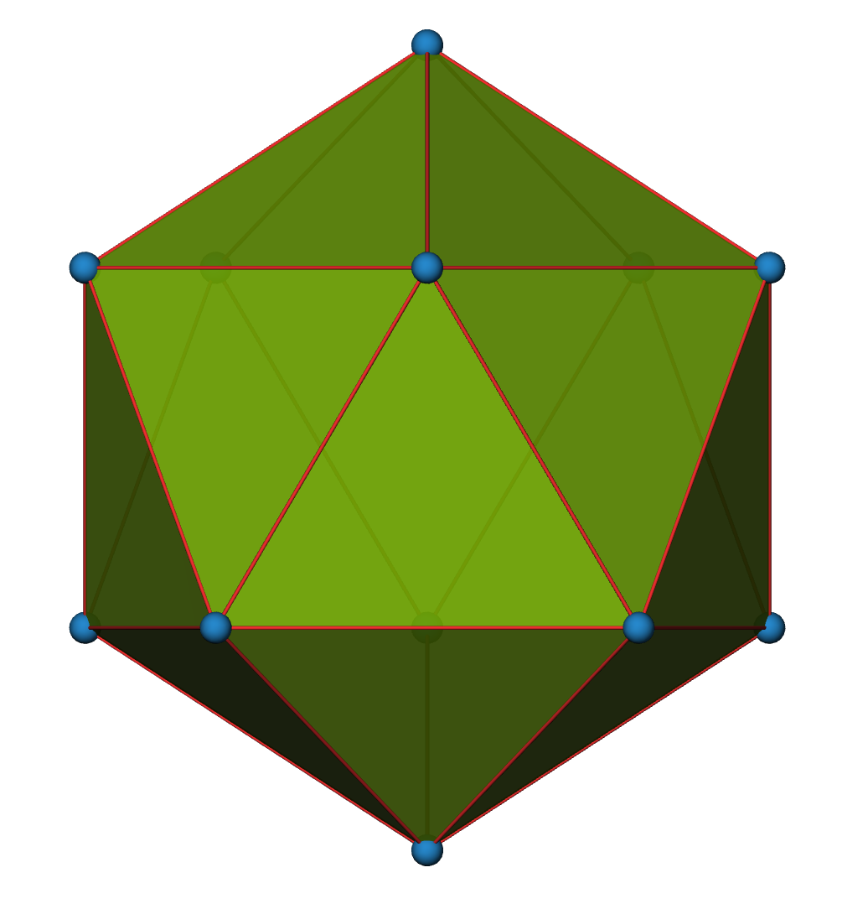
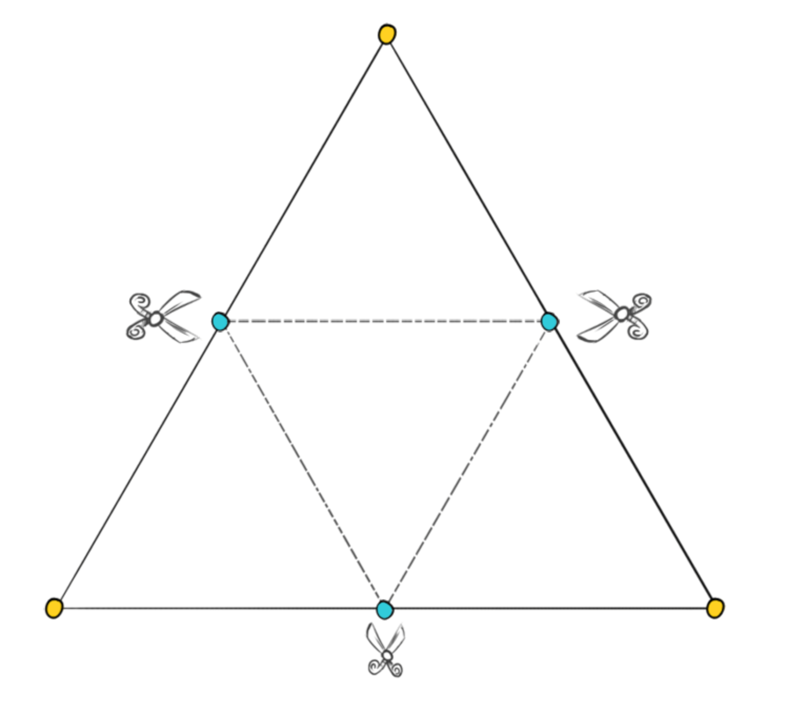
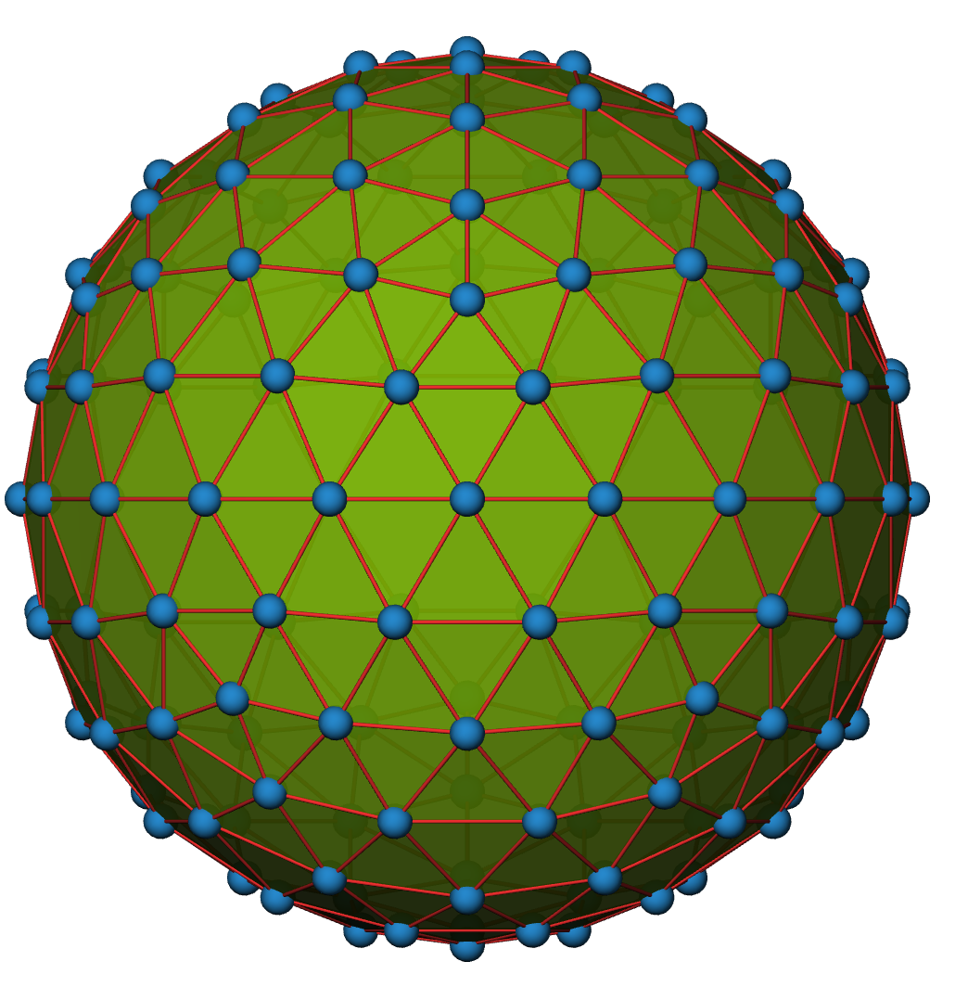

#### [HOME](../../index.html) [CONTENTS](../index.html)

## Creating an icosphere with Python

*by Yawei Liu  @Sydney, Australia 2021/02/28*

In some simulation cases, we need to use a union of points to represent a colloidal particles with a uniform surface. This can be achieved by extracting the vertices of an icosphere as the coordinates of these points. In our recent work, we developed a coarse-grained model based on the dissipative particle dynamics method to explain the oriented assembly of charged gold nanorods in the presence of an electric field [1]. In that model, we used the icosphere to create regularly distributed point charges on a rod-shaped colloidal particles.



**Fig.1 An icosahedron.**

An icosphere is constructed by subdividing faces of an icosahedron [see Fig.1], and then projecting the new vertices onto the surface of a sphere. The density of vertices depends on the level of subdivision (let us denote it by $f$). The subdivsion is the act of spliting each edge of all triangles and creating smaller triangles [see Fig.2].



**Fig.2 Strategy for subdivision.**

Here is the Python code I use to create an icosphere [2], the function ```icosphere(subdiv)``` can return the coordinates of vertices on a unit icosphere for a given value of $f$ (i.e. subdiv) [see Fig.3 for an example].



**Fig.3 An icosphere with $f=2$.**


```
import numpy as np
from scipy.spatial.transform import Rotation as R

def vertex(x, y, z): 
    """ Return vertex coordinates fixed to the unit sphere """ 
    length = np.sqrt(x**2 + y**2 + z**2) 
    return [i / length for i in (x,y,z)] 

def middle_point(verts,middle_point_cache,point_1, point_2): 
    """ Find a middle point and project to the unit sphere """ 
    # We check if we have already cut this edge first 
    # to avoid duplicated verts 
    smaller_index = min(point_1, point_2) 
    greater_index = max(point_1, point_2) 
    key = '{0}-{1}'.format(smaller_index, greater_index) 
    if key in middle_point_cache: return middle_point_cache[key] 
    # If it's not in cache, then we can cut it 
    vert_1 = verts[point_1] 
    vert_2 = verts[point_2] 
    middle = [sum(i)/2 for i in zip(vert_1, vert_2)] 
    verts.append(vertex(*middle)) 
    index = len(verts) - 1 
    middle_point_cache[key] = index 
    return index

def icosphere(subdiv):
    # verts for icosahedron
    r = (1.0 + np.sqrt(5.0)) / 2.0;
    verts = np.array([[-1.0, r, 0.0],[ 1.0, r, 0.0],[-1.0, -r, 0.0],
                      [1.0, -r, 0.0],[0.0, -1.0, r],[0.0, 1.0, r],
                      [0.0, -1.0, -r],[0.0, 1.0, -r],[r, 0.0, -1.0],
                      [r, 0.0, 1.0],[ -r, 0.0, -1.0],[-r, 0.0, 1.0]]);
    # rescale the size to radius of 0.5
    verts /= np.linalg.norm(verts[0])
    # adjust the orientation
    r = R.from_quat([[0.19322862,-0.68019314,-0.19322862,0.68019314]])
    verts = r.apply(verts)
    verts = list(verts)

    faces = [[0, 11, 5],[0, 5, 1],[0, 1, 7],[0, 7, 10],
             [0, 10, 11],[1, 5, 9],[5, 11, 4],[11, 10, 2],
             [10, 7, 6],[7, 1, 8],[3, 9, 4],[3, 4, 2],
             [3, 2, 6],[3, 6, 8],[3, 8, 9],[5, 4, 9],
             [2, 4, 11],[6, 2, 10],[8, 6, 7],[9, 8, 1],];
    
    for i in range(subdiv):
        middle_point_cache = {}
        faces_subdiv = []
        for tri in faces: 
            v1  = middle_point(verts,middle_point_cache,tri[0], tri[1])
            v2  = middle_point(verts,middle_point_cache,tri[1], tri[2])
            v3  = middle_point(verts,middle_point_cache,tri[2], tri[0])
            faces_subdiv.append([tri[0], v1, v3]) 
            faces_subdiv.append([tri[1], v2, v1]) 
            faces_subdiv.append([tri[2], v3, v2]) 
            faces_subdiv.append([v1, v2, v3]) 
        faces = faces_subdiv
                
    return np.array(verts)
    
```

### References

[1] [Zhang, H.; Liu, Y.; Shahidan, M. F. S.; Kinnear, C.; Maasoumi, F.; Cadusch, J.; Akinoglu, E. M.; James, T. D.; Widmer‐Cooper, A.; Roberts, A.; et al. Direct Assembly of Vertically Oriented, Gold Nanorod Arrays. **Adv. Funct. Mater.** 2021, 31 (6), 2006753.](https://onlinelibrary.wiley.com/doi/10.1002/adfm.202006753)

[2] This code is based on the original icosphere code in [https://sinestesia.co/blog/tutorials/python-icospheres/](https://sinestesia.co/blog/tutorials/python-icospheres/)


##### Github Page / Gitee Page / Subscription


<footer>
    <script async src="//busuanzi.ibruce.info/busuanzi/2.3/busuanzi.pure.mini.js"></script>
    <span id="busuanzi_container_page_pv" style='display:none'>
      <h6>view <span id="busuanzi_value_page_pv">       </span> times</h6>
    </span>
</footer>

<p>&copy; 2021 Yawei Liu. All content licensed under the <a href="https://creativecommons.org/licenses/by/4.0/legalcode">Creative Commons Attribution License (CC-BY)</a>.</p>

--
#### [HOME](../../index.html) [CONTENTS](../index.html)
