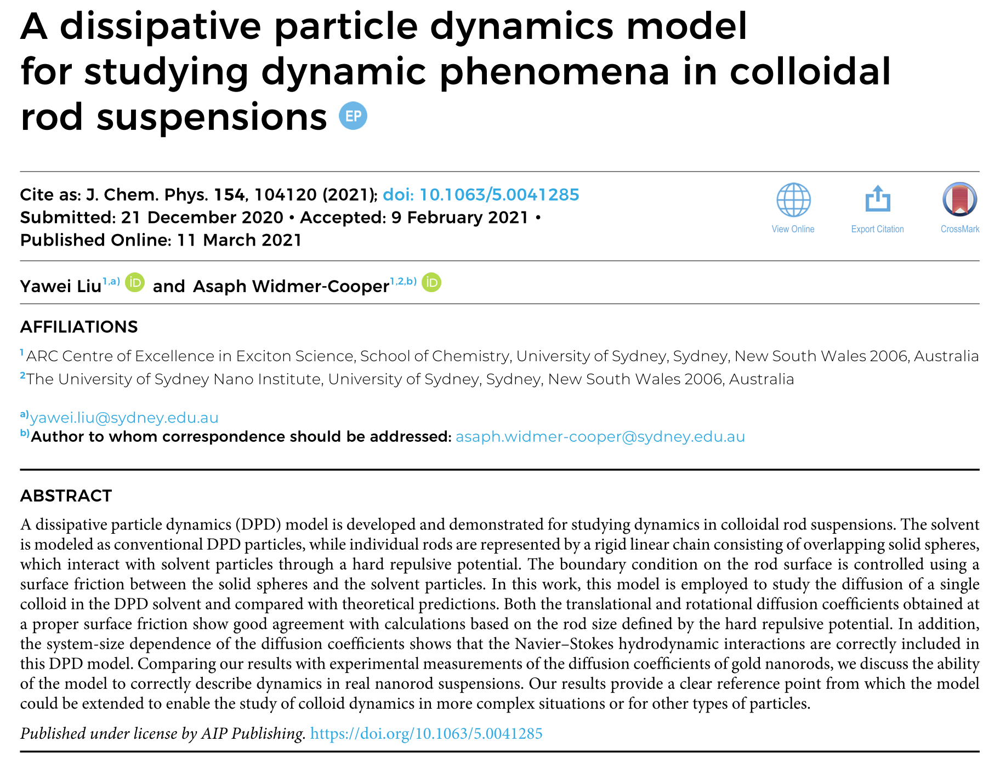

#### [HOME](../../index.html) [CONTENTS](../index.html)

## JCP selected our recent paper as an Editor's Pick

*by Yawei Liu  @Sydney, Australia 2021/03/15*

Our recent work on modelling the rod-shaped colloidal particles has been published in J. Chem. Phys.[1]. In this work, we focused on the dynamic properties of the colloidal rods, specifically, the self-diffusion, using a coarse-grained dissipative particle dynamics (DPD) model. In our model, the boundary condition on the rod surface is controlled using a surface friction between the solid and the solvent particles. Both the translational and rotational diffusion coefficients obtained at a proper surface friction show good agreement with calculations based on the rod size, and the Navier–Stokes hydrodynamic interactions are correctly included in this DPD model. Given that many experiments show that the diffusion of gold nanorods in dilute solutions can be well described by continuum theory as long as a reasonable correction to their effective hydrodynamic sizes is considered based on the thickness of the ligand layer around them, our model should be applicable to the study of other dynamic phenomena in such nanorod suspensions. For example, we have recently used our DPD model to study the oriented assembly of charged gold nanorods in the presence of an electric field [2]. (我们关于棒状胶体颗粒模型化的研究最近发表于J. Chem. Phys. [1]。在这个工作中，利用基于耗散动力学的粗粒化模型，我们研究了溶液中胶体棒的动力学行为，特别是自扩散现象。在我们的模型中，颗粒表面的边界条件通过固体和溶剂粒子之间的表面摩擦力来控制。我们发现，在适当的表面摩擦下获得的平移和旋转扩散系数与基于杆尺寸的计算显示出良好的一致性，并且该模型正确地包含了Navier-Stokes流体动力相互作用。鉴于许多实验表明，只要根据金纳米棒在周围配体层的厚度对其有效流体动力学尺寸进行合理的校正，就可以用连续介质理论很好地描述金纳米棒在稀溶液中的扩散，因此我们的模型可用于研究这些纳米棒悬浮液中的其他动力学现象。例如，最近我们基于一个扩展模型研究了在电场存在下带电金纳米棒的定向组装 [2]。)

Gold nanorods have now become one of the most widely used platforms for developing new techniques in diverse fields such as chemical sensing and imaging, photothermal therapy, solar cells, display technologies,  drug delivery because of their unique and anisotropic physical properties. The Editor thought "this paper would be of high interest since the current interest in gold nanorods is huge", and chose our paper as an "Editor's Pick". (金纳米棒由于其独特且各向异性的物理特性，现已成为在各种领域——化学传感和成像，光热疗法，太阳能电池，显示技术，药物输送等——开发新技术的平台之一。编辑认为“由于当前人们对金纳米棒的广泛关注，该论文将引起相关读者的极大兴趣”，并选择了我们的论文作为“编辑推荐”。)

### References

[1] [Liu, Y.; Widmer-Cooper, A. A Dissipative Particle Dynamics Model for Studying Dynamic Phenomena in Colloidal Rod Suspensions. J. Chem. Phys. 2021, 154 (10), 104120.](https://aip.scitation.org/doi/10.1063/5.0041285)

[2] [Zhang, H.; Liu, Y.; Shahidan, M. F. S.; Kinnear, C.; Maasoumi, F.; Cadusch, J.; Akinoglu, E. M.; James, T. D.; Widmer‐Cooper, A.; Roberts, A.; et al. Direct Assembly of Vertically Oriented, Gold Nanorod Arrays. Adv. Funct. Mater. 2021, 31 (6), 2006753.](https://onlinelibrary.wiley.com/doi/10.1002/adfm.202006753)

##### Github Page / Gitee Page / Subscription

<footer>
    
    
      <h6>view         times</h6>
    
</footer>

&copy; 2021 Yawei Liu. All content licensed under the <a href="https://creativecommons.org/licenses/by/4.0/legalcode">Creative Commons Attribution License (CC-BY 4.0)</a>.

--
#### [HOME](../../index.html) [CONTENTS](../index.html)
