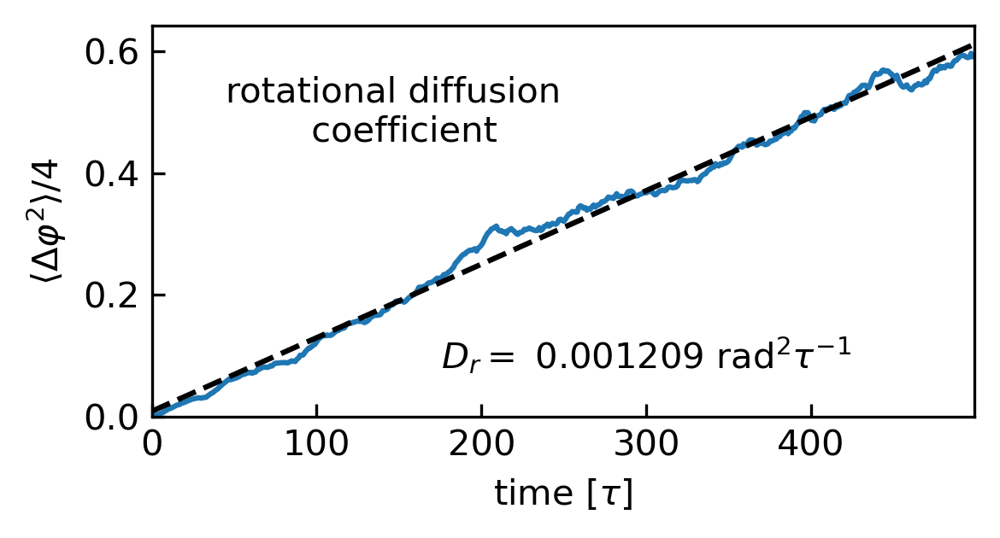

#### [HOME](../../index.html) [CONTENTS](../index.html)

## Analysing simulation trajectory to obtain the rotational diffusion coefficient
 
*by Yawei Liu  @ Sydney, Australia 2021/03/21*

In our recent work on modelling the rod-shaped colloidal particles [1], we calculated the orientational diffusion coefficient from the rotational trajectories of the rod.

Analogous to the translational diffusion coefficient that can be evaluated from
the mean-square displacement (MSD) of the colloidal particle, the rotational diffusion ($D_{r}$) is quantified through the *rotational* (or *angular*) mean-square displacement (RMSD, $\langle \Delta \vec{\varphi}^2(t) \rangle$) during time interval $t$ as follows:
$$\langle \Delta \vec{\varphi}^2(t) \rangle= \langle | \vec{\varphi}(t_0+t)-\vec{\varphi}(t_0)|^2 \rangle = 4D_{r} t.$$

To calculate $D_{r}$, we record the behaviour of the normalised vector $\hat{\textbf{u}}$ along the long axis for the rod from the simulations. The rod rotation will cause a rotation of $\hat{\textbf{u}}$. A example of the raw data is given below.

```
time    ux           uy            uz
0 	    -0.736488 	-0.143350 	-0.661087
1 	    -0.725873 	-0.102392 	-0.680165
2 	    -0.683607 	-0.098802 	-0.723132
3 	    -0.688952 	-0.107917 	-0.716728
4 	    -0.673349 	-0.085803 	-0.734329
... 	... 	... 	... 	...
495 	-0.527682 	0.422441 	-0.736950
496 	-0.542749 	0.486355 	-0.684750
497 	-0.531806 	0.554231 	-0.640320
498 	-0.562532 	0.621685 	-0.545037
499 	-0.579522 	0.649882 	-0.491740
```

However, a naive definition of rotational displacement as $[\hat{\textbf{u}}(t)-\hat{\textbf{u}}(t_0)]$ would be insensitive to full rod rotations, since it would result in a bounded quantity (i.e. the value of $[\hat{\textbf{u}}(t)-\hat{\textbf{u}}(t_0)]$ is finite even the time goes to infinity). One way to avoid this complication is defining the vector rotational displacement as
$$\vec{\varphi}(t)=\int_{0}^{t} \Delta \vec{\varphi}(t') dt'$$
with $\Delta \vec{\varphi}(t')$ a vector with direction given by $\hat{\textbf{u}}(t) \times \hat{\textbf{u}}(t+t')$ and with magnitude given by $\cos^{-1}[\hat{\textbf{u}}(t) \cdot \hat{\textbf{u}}(t+t')]$ during the time interval $t'$. With this definition, RMSD is unbounded and the rotational diffusion coefficient can be evaluated in a large time range [2].


Here is a Python script to process raw data to calculate $D_{r}$.

```
import numpy as np 
import pandas as pd
from scipy.optimize import curve_fit
import matplotlib.pyplot as plt

def _linear_function(x,a,b):
    return a*x+b

def _compute_RMSD(raw_data_filename):
    data = pd.read_csv(raw_data_filename,sep='\s+')
    data=data[['time','ux','uy','uz']]
    data['time']=data['time']-data['time'].values[0]
    us = data[['ux','uy','uz']].values
    phi = np.zeros((len(data),3))
    for i in range(1,len(data)):
        c = np.cross(us[i-1],us[i])
        if np.linalg.norm(c): c = c/np.linalg.norm(c)
        dot = np.dot(us[i-1],us[i])
        theta = np.arccos(dot)
        phi[i,:] = phi[i-1]+theta*c
    data[['phix','phiy','phiz']] = phi
    
    coords = data[['phix','phiy','phiz']].values
    tmp = np.sum(coords**2., axis=1)
    data['RMSD'] = np.sum(coords**2., axis=1)
    return data

def _average_RMSD(data):
    for i in range(len(data)):
        if i==0: sum_RMSD = data[i]['RMSD'].values
        else: sum_RMSD += data[i]['RMSD'].values
    ave_RMSD = sum_RMSD/len(data)
    time = data[0]['time']
    return pd.DataFrame({'time': time,'RMSD':ave_RMSD})
    
def _plot_RMSD(data):
    fig = plt.figure(figsize=(4,2.2), dpi=300);
    ax = fig.add_subplot(111);
    x = data['time'].values
    y = data['RMSD'].values/4
    ax.plot(x,y);
    popt, pcov = curve_fit(_linear_function, x, y)
    perr = np.sqrt(np.diag(pcov))
    
    ax.text(120,0.5,r'$D_{r}=$ %.6f $\tau^{-1}$' %(popt[0]),va="center", ha="center")
    
    y_fit = _linear_function(x,*popt)
    ax.plot(x,y_fit,'k--');
    
    ax.set_xlabel(r'time [$\tau$]');
    ax.set_ylabel(r'$\langle \Delta \varphi^2 \rangle/4$')
    ax.set_xlim(min(x),max(x));
    ax.set_ylim(0,);
    ax.tick_params(direction='in')
    plt.tight_layout()
    plt.show()

if __name__ == "__main__":  
    data = []
    for i in range(1,50):
        raw_data_filename = 'result_trj%03d.log'%i
        RMSD = _compute_RMSD(raw_data_filename)
        data.append(RMSD)
    RMSD = _average_RMSD(data)
    _plot_RMSD(RMSD)
```

```_compute_RMSD``` reads a file of raw data and returns the corresponding RMSD Pandas DataFrame as shown below:

```
time 	ux 	uy 	uz 	phix 	phiy 	phiz 	RMSD
0 	    -0.736488 	-0.143350 	-0.661087 	0.000000 	0.000000 	0.000000 	0.000000
1 	    -0.725873 	-0.102392 	-0.680165 	0.029822 	-0.021077 	-0.028654 	0.002155
2 	    -0.683607 	-0.098802 	-0.723132 	0.036668 	-0.081049 	-0.026931 	0.008639
3 	    -0.688952 	-0.107917 	-0.716728 	0.029444 	-0.072806 	-0.021228 	0.006618
4 	   -0.673349 	-0.085803 	-0.734329 	0.047196 	-0.096119 	-0.034782 	0.012676
... 	... 	... 	... 	... 	... 	... 	... 	...
495 	-0.527682 	0.422441 	-0.736950 	0.854880 	-0.560132 	0.409323 	1.212112
496 	-0.542749 	0.486355 	-0.684750 	0.924113 	-0.521438 	0.381930 	1.271754
497 	-0.531806 	0.554231 	-0.640320 	0.992276 	-0.504799 	0.339721 	1.354844
498 	-0.562532 	0.621685 	-0.545037 	1.088512 	-0.434280 	0.320831 	1.476390
499 	-0.579522 	0.649882 	-0.491740 	1.137045 	-0.395013 	0.315529 	1.548466
```

```_average_RMSD``` takes a list of several RMSD Pandas DateFrames and returns the average RMSD Pandas DataFrame as shown below:

```
time 	RMSD
0 	   0.000000
1 	   0.002518
2 	   0.006679
3 	   0.011331
4 	   0.014926
... 	... 	...
495 	2.430836
496 	2.434438
497 	2.459464
498 	2.452927
499 	2.470744
``` 
```_plot_RMSD``` takes an (average) RMSD Pandas DateFrame, performs the linear fitting and plots the results as shown below (raw data for this example can be downloaded from <a href="data/rod_diffusion/20210321raw_data_rod_rotational_diffsuion.zip">here</a>):



### References

[1] [Liu, Y.; Widmer-Cooper, A. A Dissipative Particle Dynamics Model for Studying Dynamic Phenomena in Colloidal Rod Suspensions. J. Chem. Phys. 2021, 154 (10), 104120.](https://aip.scitation.org/doi/10.1063/5.0041285)

[2] [Kämmerer, S.; Kob, W.; Schilling, R. Dynamics of the Rotational Degrees of Freedom in a Supercooled Liquid of Diatomic Molecules. Phys. Rev. E 1997, 56 (5), 5450–5461.](https://link.aps.org/doi/10.1103/PhysRevE.56.5450)


##### Github Page / Gitee Page / Subscription


<p>&copy; 2021 Yawei Liu. All content licensed under the <a href="https://creativecommons.org/licenses/by/4.0/legalcode">Creative Commons Attribution License (CC-BY 4.0)</a>.</p>

--
#### [HOME](../../index.html) [CONTENTS](../index.html)
