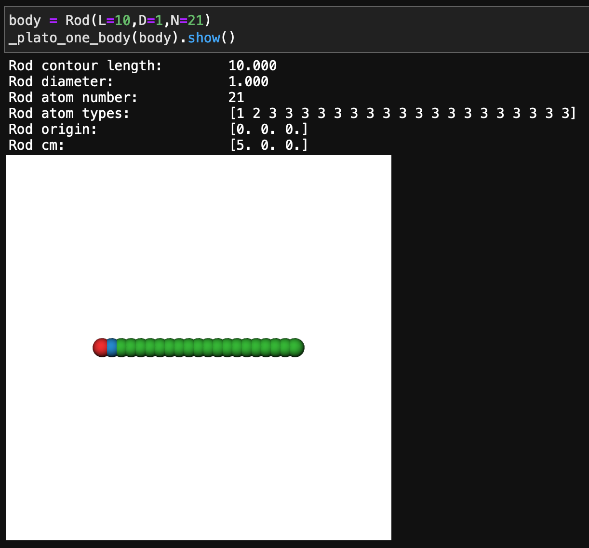
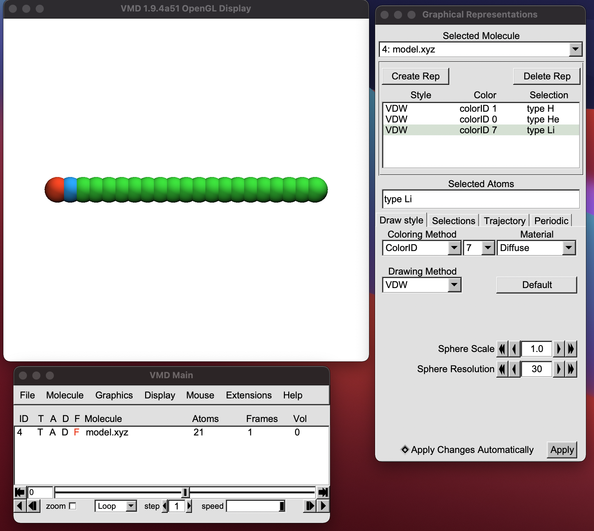

#### [HOME](../../index.html) [CONTENTS](../index.html)

## Dynamics simulations of self-assembly of nanoparticles (Tutorial III: Visulizing model)
 
*by Yawei Liu  @ Sydney, Australia 2021/04/18*

In this tutorial, I am going to show how to visualise the model of nanoparticles we create in last tutorial.

The first method is using [Plato](https://plato-draw.readthedocs.io/en/latest/), which can directly show the model in [Jupyterlab](https://jupyterlab.readthedocs.io/en/stable/). The Python code to do this is

```
import matplotlib
import plato
import plato.draw.pythreejs as draw

def _plato_one_body(body,size=(20, 20)):
    red = matplotlib.colors.to_rgba('tab:red')
    green = matplotlib.colors.to_rgba('tab:green')
    blue = matplotlib.colors.to_rgba('tab:blue')

    positions = body.atoms
    positions = positions-body.cm
    colors = np.zeros((body.N,4))
    colors[:] = green
    colors[body.atom_types==1] = red
    colors[body.atom_types==2] = blue
    
    radii = np.zeros(body.N)
    radii[:] = body.D/2.
    
    sphere_prim = draw.Spheres(
        positions=positions,
        radii=radii,
        colors=colors,
        vertex_count=200
        )
    return draw.Scene((sphere_prim), zoom=1.,size=size)
```

Running ```body=Rod(L=10,D=1,N=21)``` and ```_plato_one_body(body).show()```, one can obtain an interactive window of the rod model (tips: the model can be rotated using the mouse), as shown below:



Another method is writing the information of the model into an external file and then using VMD to visualise it.

Here is a Python script to create an ```xyz``` file of the model:

```
with open('model.xyz','w') as f:
    f.write('%d\n' %(body.N))
    f.write('\n')
    atoms = np.concatenate((body.atom_types[:,None], body.atoms-body.cm), axis=1)
    np.savetxt(f, atoms, fmt='%3d %.6f %.6f %.6f', delimiter=' ')
```

Then one can open the ```xyz``` file with VMD to visualize the model. I often use an VMD script to do this so the render properties can be easily controlled. Here is an example of the VMD script named ```vmd.tcl```: 

```
color change rgb  0 0.122 0.467 0.706 ;# blue
color change rgb  1 0.7 0.2 0.1 ;# red
color change rgb  2 0.5 0.5 0.5 ;# grey
color change rgb  3 0.7 0.4 0.0 ;# orange
#color change rgb  4 0.74 0.74 0.13 ;# yellow
color change rgb  4 0.68 0.51 0.00 ;# yellow
color change rgb  7 0.17 0.63 0.17 ;# green
color change rgb 9 0.89 0.47 0.76 ;# pink
color change rgb 10 0.09 0.75 0.81 ;# cyan
color change rgb 11 0.58 0.40 0.74 ;# purple

# make sure, that the main menu is active
menu main on
# modify display settings
display projection orthographic
#orthographic
#axes location off
color Display Background white

# change material 'Diffuse'
material change ambient Diffuse 0.00
material change specular Diffuse 0.0
material change diffuse Diffuse 0.9
material change shininess Diffuse 0.7
material change opacity Diffuse 1.0
material change outline Diffuse 4.
material change outlinewidth Diffuse 1.


###delete current molecules & load new molecules
if {[molinfo num] > 0} { 
  mol delete all
}

set fname "model.xyz"
mol new $fname waitfor all
##delete all rep
set numrep [molinfo top get numreps]
for {set i 0} {$i < $numrep} {incr i} {mol delrep $i top}


scale by 1.5

mol selection all
mol representation VDW 1.0 30.0
mol material Diffuse
mol color colorID 0

set all [atomselect top "all"]
$all set radius 0.5

mol selection "type H"
mol addrep top
mol modcolor 0 top colorID 1

mol selection "type He"
mol addrep top
mol modcolor 1 top colorID 0

mol selection "type Li"
mol addrep top
mol modcolor 2 top colorID 7
``` 
To use this VMD script, just type ```source vmd.tcl``` in the terminal or the VMD TkConsole. The VMD visualisation is shown below:
 



##### Github Page / Gitee Page / Subscription


<p>&copy; 2021 Yawei Liu. All content licensed under the <a href="https://creativecommons.org/licenses/by-nc/4.0/legalcode#languages">Creative Commons Attribution-NonCommercial License 4.0 International (CC BY-NC 4.0)</a>.</p>

--
#### [HOME](../../index.html) [CONTENTS](../index.html)
