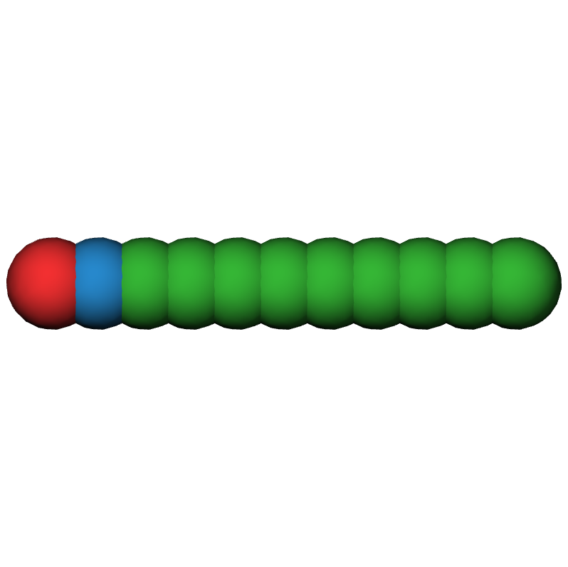
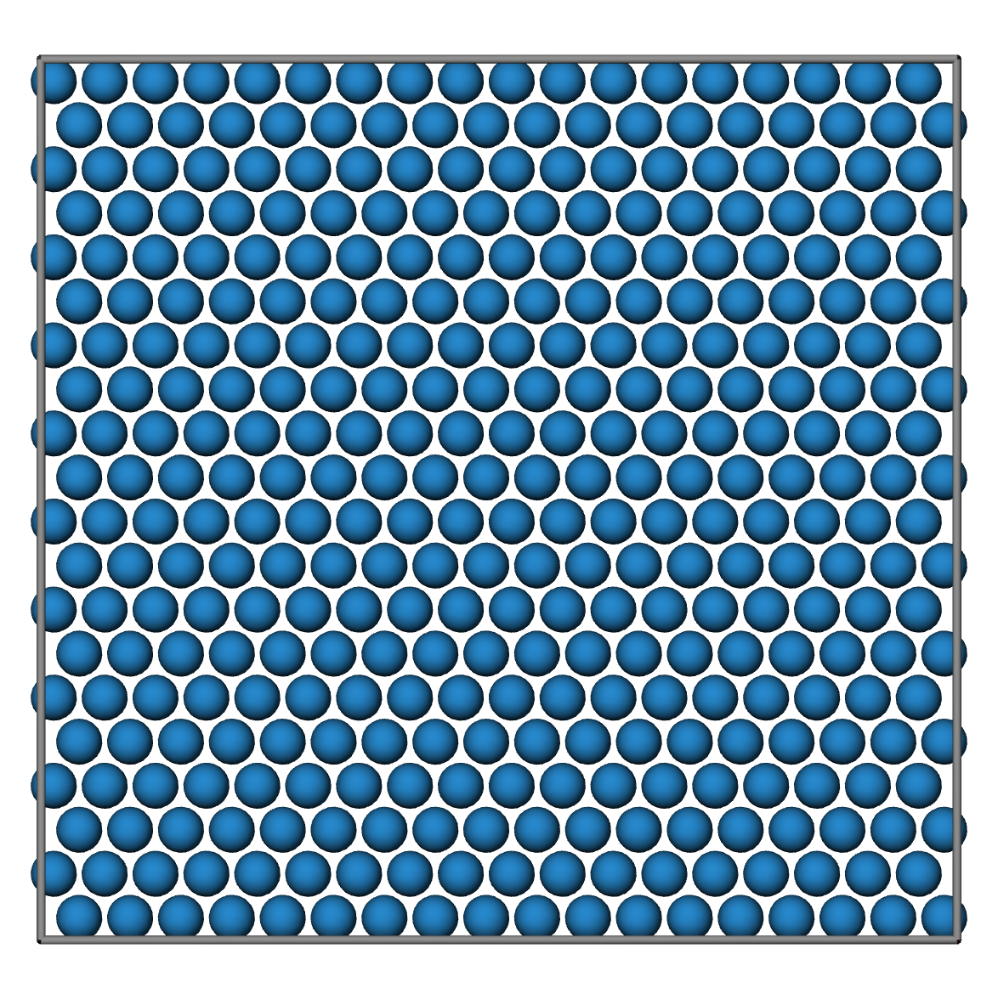
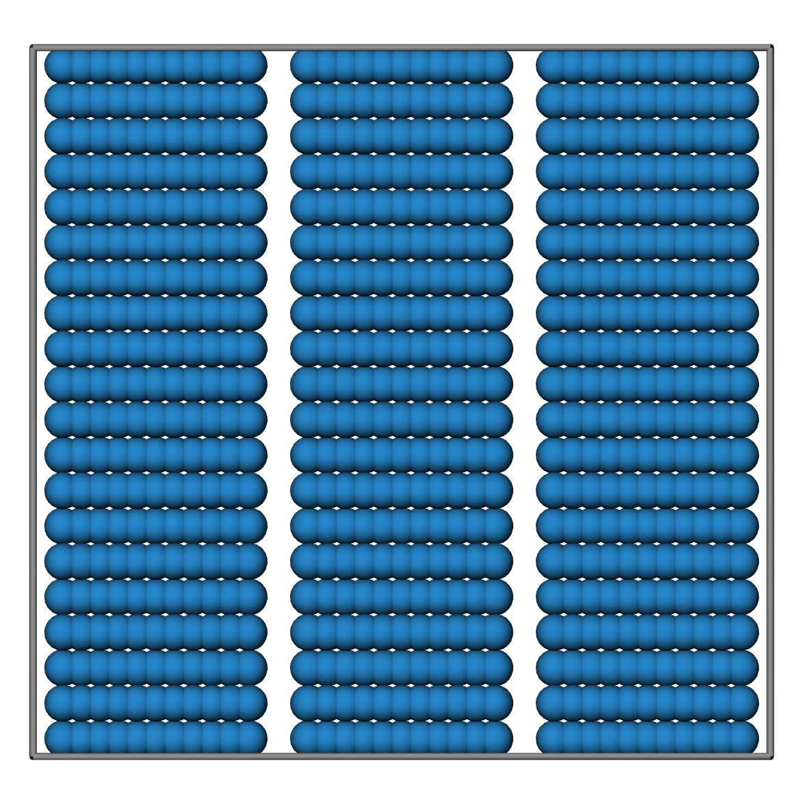

#### [HOME](../../index.html) [CONTENTS](../index.html)

## Dynamics simulations of self-assembly of nanoparticles (Tutorial IV: Creating LAMMPS data file)
 
*by Yawei Liu  @ Sydney, Australia 2021/04/25*

In this tutorial, I am going to show how to build an initial configuration with the model for rod-shaped nanoparticle of $L=5$, $D=1$ and $N=11$, i.e. ```body = Rod(L=5,D=1,N=11)``` as shown below:



The initial configuration is a group of rod with their centre-of-mass arranged in a regular lattice (i.e. a set of points in space, determined by a unit cell with basis atoms, that is replicated infinitely in all dimensions). The lattice I am going to use is hexagonal in the $x-y$ plane and is replicated in the $z$-direction. All rods are aligned in $z$-direction in the initial configuration.

Here is Python code used to create the lattice according to the size of rod:

```
def _lattices(body,nx,ny,nz):
    scale = 1.1 #adjust the distance between bodys
    #lattice edges
    ax = (body.L+body.D)*scale
    ay = body.D*np.sqrt(3)*scale
    az = body.D*scale
    
    lattices = [(ax * i, ay * j, az * k) for i in range(nx) for j in range(ny) for k in range(nz)] \
            + [(ax * i, ay * j + ay / 2.0, az * k + az / 2.0) for i in range(nx) for j in range(ny) for k in range(nz)]
    lattices = np.array(lattices)
    lattices = lattices - np.sum(lattices, axis=0) / len(lattices)
    boxL = np.array([ax*nx,ay*ny,az*nz])
    return boxL,lattices
```
Here, $nx$, $ny$ and $nz$ control the number of unit cells in the lattice. Using ```boxL,lattices = _lattices(body,nx=3,ny=10,nz=18)```, a lattice for $2 nx \cdot ny \cdot nz=1080$ rods is obtained. Putting the rods in the lattice, the initial configuration is




A data file of LAMMPS for this initial configuration can be created using Python code as follow:

```
def _write_lammps_data_file(body,boxL,lattices):
    atom_number = len(lattices)*body.N
    xlo = -boxL[0]/2; xhi = -xlo
    ylo = -boxL[1]/2; yhi = -ylo
    zlo = -boxL[2]/2; zhi = -zlo
    with open('init.dat','w') as f:
        f.write("rods in AAA configuration\n")
        f.write("\n")
        f.write("%d atoms\n" %atom_number)
        f.write("%d bonds\n" %0)
        f.write("\n")
        f.write("3 atom types\n")
        f.write("%d bond types\n" %0)
        f.write("\n")
        f.write("%f %f xlo xhi\n" %(xlo,xhi))
        f.write("%f %f ylo yhi\n" %(ylo,yhi))
        f.write("%f %f zlo zhi\n" %(zlo,zhi))
        f.write("\n")
    
        f.write("Atoms\n")
        f.write("\n")
        atomid = 0; molid = 0
        for lattice in lattices:
            molid += 1
            for i,atom in enumerate(body.atoms):
                atomid += 1
                ix = lattice[0]+atom[0]-body.cm[0]
                iy = lattice[1]+atom[1]-body.cm[1]
                iz = lattice[2]+atom[2]-body.cm[2]
                itype = body.atom_types[i]
                if itype==1:
                    f.write("%5d %2d %12.6f %12.6f %12.6f %2d 0 1 0 0\n" %(atomid,itype,ix,iy,iz,molid))
                elif itype==2:
                    f.write("%5d %2d %12.6f %12.6f %12.6f %2d 0 0 1 0\n" %(atomid,itype,ix,iy,iz,molid))
                else:
                    f.write("%5d %2d %12.6f %12.6f %12.6f %2d 0 0 0 0\n" %(atomid,itype,ix,iy,iz,molid))
        f.write("\n")
```
Note that in the following simulations, I am going to use ```atom_style hybrid bond dipole```, thus in the data file, each atom has an attribute list: [```id type ix iy iz mol q mux muy muz```](https://lammps.sandia.gov/doc/read_data.html).


##### Github Page / Gitee Page / Subscription


<p>&copy; 2021 Yawei Liu. All content licensed under the <a href="https://creativecommons.org/licenses/by-nc/4.0/legalcode#languages">Creative Commons Attribution-NonCommercial License 4.0 International (CC BY-NC 4.0)</a>.</p>

--
#### [HOME](../../index.html) [CONTENTS](../index.html)
